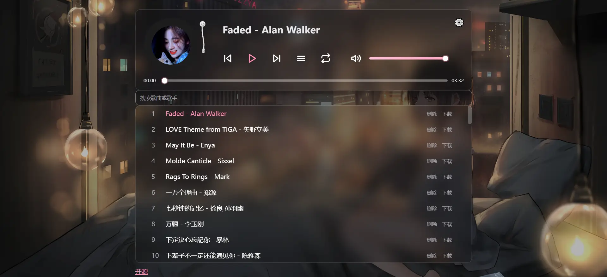

# 🎵 Music Player

## 一个现代化的筒约音乐播放器，支持在线播放，歌单管理，MV播放等功能，采用 React + Vite 构建，支持Cloudflare Pages和Docker 部署。

<p align="center">
  
</p>

<p align="center">
  <a href="https://opensource.org/licenses/MIT">
    
  </a>
  <a href="https://reactjs.org/">
    
  </a>
  <a href="https://vitejs.dev/">
    
  </a>
  <a href="https://www.javascript.com/">
    
  </a>
  <a href="https://pages.cloudflare.com/">
    
  </a>
  <a href="https://github.com/zxlwq/music">
    
  </a>
  <a href="https://hub.docker.com/r/zxlwq/music">
    
  </a>
</p>




### 技术栈

- **前端框架** - React 18
- **构建工具** - Vite
- **样式** - 原生 CSS
- **部署** - Github + Cloudflare Pages


### 🎶 核心功能
- **在线音乐播放** - 支持多种音频格式
- **歌单管理** - 添加、删除、搜索歌曲
- **MV 播放** - 支持为歌曲添加MV链接
- **歌单导入** - 支持从GitHub仓库API导入歌单
- **美化设置** - 自定义字体、背景图片
- **响应式设计** - 完美适配移动端和桌面端

## 🚀 快速开始

### Cloudflare Pages

1. 连接 GitHub 仓库到 Cloudflare Pages
2. 框架预设：`React (Vite)`
3. 添加环境变量
4. 部署完成

## ⚙️ 配置说明

### 环境变量

在项目根目录创建 `.env` 文件：

```env
GIT_REPO=用户名/仓库名
GIT_BRANCH=默认main分支 (可选) 
GIT_TOKEN=github-token
PASSWORD=管理员密码
GIT_URL=https://proxy.com 自定义代理服务（可选）
```
### WebDAV 云盘上传/恢复
```env
WEBDAV_URL=https://dav.example.com
WEBDAV_USER=用户名
WEBDAV_PASS=密码
```

### 歌单配置

项目支持多种歌单配置方式：

1. **本地歌单** - 在 `public/music/` 目录放置音频文件
2. **GitHub 仓库** - 通过 GitHub API导入歌单
3. **外部 API** - 支持[Player项目](https://github.com/zxlwq/Player) API歌单导入

## 🎵 使用指南

### 添加歌曲

1. 点击右上角设置按钮
2. 填写歌曲信息：
   - 音频文件 URL
   - 歌名 - 歌手
   - MV 链接（可选）
3. 点击"添加歌曲"按钮

### 导入歌单

1. 选择导入方式：
   - **GitHub 仓库** - 从 GitHub 仓库导入
   - **API 接口** - 从[Player项目](https://github.com/zxlwq/Player) API歌单导入
2. 填写相关信息并导入

### 美化设置

1. 自定义选项：
   - **字体设置** - 选择喜欢的字体
   - **背景图片** - 设置自定义背景

## 添加新唱片封面后，需要更新以下两个文件中的封面列表：

   **修改 `src/App.jsx`**：
   ```javascript
   // 第37行和第447行，更新 localPreferred 数组
   const localPreferred = ['a.webp','b.webp','c.webp','d.webp','e.webp','f.webp','g.webp','h.webp','i.webp','j.webp','k.webp','l.webp','m.webp','n.webp','o.webp','p.webp','q.webp','r.webp','s.webp','t.webp','u.webp','v.webp','w.webp','x.webp','y.webp','z.webp']
   ```

   **修改 `scripts/generate.mjs`**：
   ```javascript
   // 第58-60行，更新 preferredOrder 数组
   const preferredOrder = [
     'a.webp','b.webp','c.webp','d.webp','e.webp','f.webp','g.webp','h.webp','i.webp','j.webp','k.webp','l.webp','m.webp','n.webp','o.webp','p.webp','q.webp','r.webp','s.webp','t.webp','u.webp','v.webp','w.webp','x.webp','y.webp','z.webp'
   ]
   ```

## 📄 许可证

本项目基于 MIT 许可证开源 - 查看 [LICENSE](LICENSE) 文件了解详情。


⭐ 如果这个项目对您有帮助，请给一个星标！
